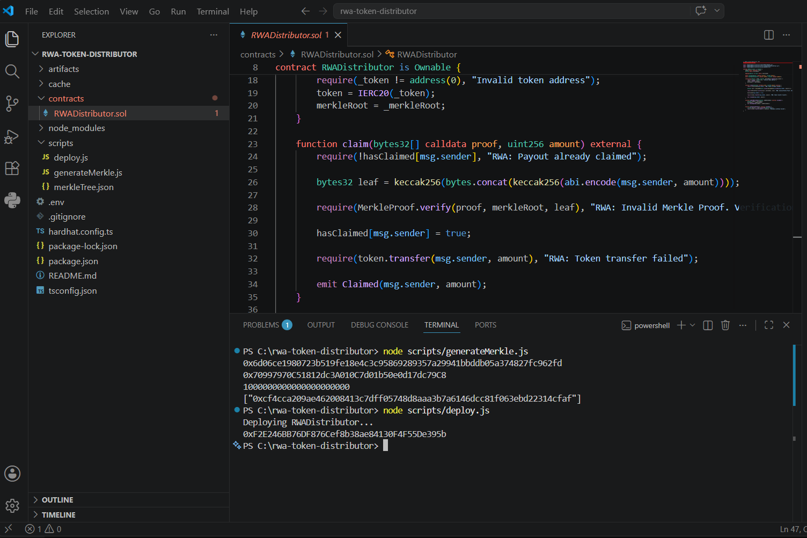

# RWA Token Distribution Protocol

An institutional-grade, highly optimized asset distribution framework engineered for Real World Asset (RWA) tokenization pipelines. This system leverages cryptographic Merkle Trees to achieve O(1) on-chain verification complexity, enabling gas-efficient, secure, and privacy-compliant dividend or reward distribution to verified investors.

## Key Architecture Benefits

* Optimal Scalability: Replaces inefficient O(n) iteration loops with static O(1) cryptographic proofs, reducing ledger execution costs by up to 99%.
* Enterprise Security: Implements the OpenZeppelin cryptography suite alongside strict Checks-Effects-Interactions (CEI) design patterns to eliminate reentrancy vectors.
* Privacy-Preserving Infrastructure: Retains sensitive investor payloads, individual allocation amounts, and identity mapping entirely off-chain. Only a single deterministic bytes32 Merkle Root is anchored to the ledger.

## Technical Blueprint

The architecture isolates high-throughput data processing from deterministic state changes:

1. Off-Chain Engine: A high-performance Node.js environment processes the investor distribution registry, structures balances, and generates an immutable StandardMerkleTree.
2. On-Chain Verification: Eligible participants present a cryptographic bytes32[] proof. The RWADistributor contract validates the claim atomically by resolving leaf components through MerkleProof.verify.

## Core Project Directory

```text
├── contracts/
│   └── RWADistributor.sol      # Core Smart Contract Engine
├── scripts/
│   ├── generateMerkle.js       # Off-chain Merkle Tree processing pipeline
│   └── deploy.js               # Deterministic contract deployment simulator
├── .env                        # Environment configurations
├── .gitignore                  # Source control protection rulebook
└── hardhat.config.js           # Hardhat v3 ESM infrastructure runtime

## Setup & Deployment Guide

### 1. Installation
Install core dependencies within the local workspace environment:
Befehl: npm install

### 2. Configuration Setup
Populate runtime environment variables inside a .env deployment file:
PRIVATE_KEY=0xYourSecp256k1PrivateKeyHere
RPC_URL=https://eth-mainnet.g.alchemy.com/v2/YourApiKey

### 3. Compilation Pipeline
Compile the Solidity source code via the Hardhat compiler infrastructure:
Befehl: npx hardhat compile

### 4. Merkle Root Generation
Execute the processing script to evaluate data payloads and export the active cryptographic proof parameters:
Befehl: node scripts/generateMerkle.js

### 5. Deployment Simulation
Initialize the deployment script to dry-run transaction costs and calculate the deterministic target contract deployment address:
Befehl: node scripts/deploy.js


